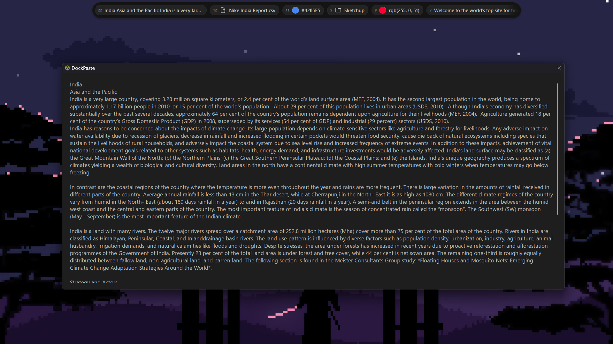
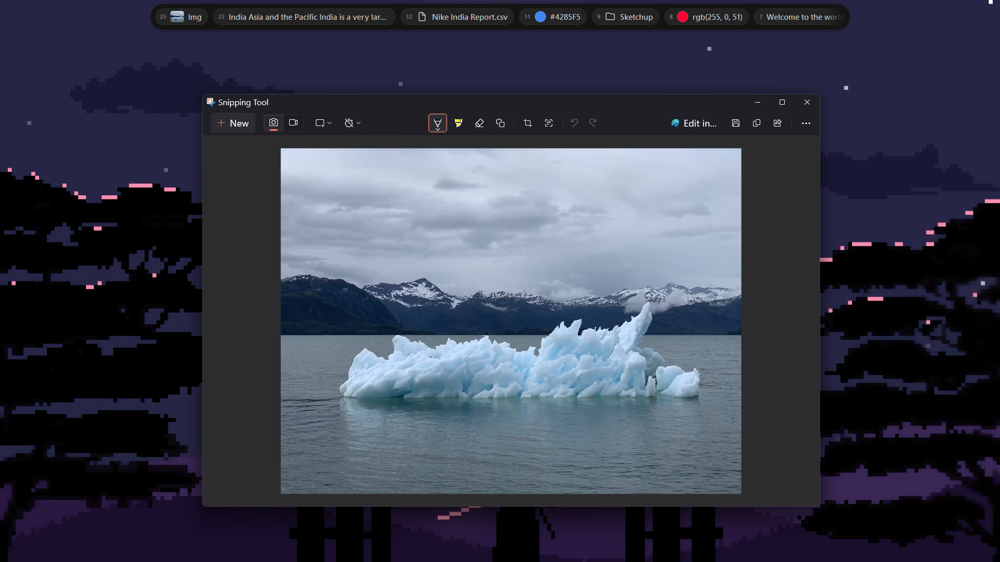
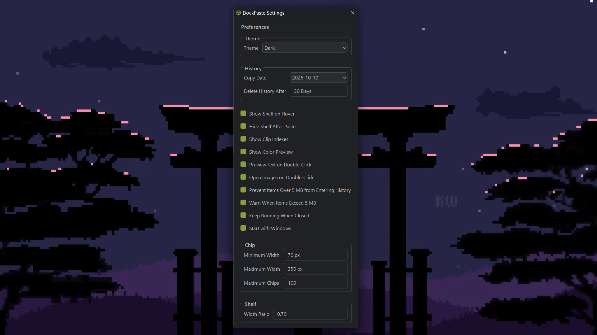

# DockPaste

DockPaste is a lightweight clipboard history shelf built with Python, PySide6, and Qt. It keeps recently copied items close at hand so you can find and paste them again without switching to a separate clipboard manager.

DockPaste is still a work in progress, so you might run into a few bugs or unfinished bits.

## About

I’m not a software developer, and I started DockPaste with no app development experience. The idea came to me, and I shaped it into an app as I learned along the way. I’m sharing it openly so anyone can help fix bugs, solve problems, and make DockPaste better.

## Features

- Automatically saves copied text, links, file paths, images, and screenshots to local history.
- Shows clips as compact chips in a floating shelf. Click a chip to paste it into the active app.
- Drag and drop text, files, and images into the shelf.
- Pin clips, delete individual clips, or clear all unpinned clips.
- Browse history by copy date. History is stored between app launches and is automatically removed after the retention period.
- Choose how long to keep history in Settings; the default is 30 days.
- Preview text or open copied images on double-click, with separate settings for each.
- Show color previews and website favicons on supported clips.
- Configure the shelf to appear on hover, hide after pasting, or keep running in the system tray.
- Set the maximum number of visible chips (100 by default; configurable from 50 to 500).
- Set a Windows startup option, adjust shelf size, and choose from multiple themes.
- Optionally prevent clipboard items larger than 5 MB from entering history and show a warning when an item is skipped.
- On Windows, press **Ctrl + Win** to pin or unpin the shelf.

### Preview Text
*Double-click to preview text*

### Preview Images
*Double-click to preview image*

## Themes

### Dark

### One Dark Pro Night Flat

### Dracula

## Settings

## Install on Windows

1. Open the [latest GitHub release](https://github.com/NishantSingh359/DockPaste/releases).
2. Download and run `DockPaste-Setup-v1.5.exe`.
3. Follow the installer, then launch DockPaste from the Start menu or the optional desktop shortcut.

DockPaste currently provides a Windows installer for 64-bit Windows 10 and Windows 11.

### Windows SmartScreen

Because DockPaste is an unsigned indie and open-source app, Windows may display “Windows protected your PC.” If you trust the installer, select **More info**, then **Run anyway**.

## Privacy

Clipboard history and settings are stored locally on your device. DockPaste does not sync clipboard data to the cloud or include telemetry. When link favicons or copied remote images are used, DockPaste may contact the corresponding website to retrieve them. Old history is removed automatically according to the retention setting.

## Contributing

DockPaste is an open-source project, and everyone is welcome to help make it better. Report bugs, suggest improvements, or submit a fix through the [GitHub repository](https://github.com/NishantSingh359/DockPaste).
